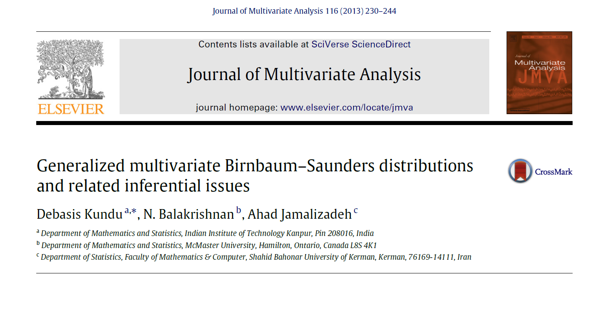

## Artigo

{fig-alt="Capa do artigo indicado."}

## Caracterização da Revista

**Journal of Multivariate Analysis (JMVA)**

- Periódico americano em estatística, probabilidade e matemática aplicada, com publicações desde 1971
- Tópicos de interesse: cópulas, análise funcional de dados, modelos gráficos, modelagem am altas dimensões, valores extremos, estatística espacial

| Indicador | Valor | Interpretação |
|-----------|-------|---------------|
| SJR 2024 | 1,009 | Acima da média — medianas ficam em 0,2–0,4 |
| Quartil | Q1 | Faixa de maior prestígio na área |
| H-Index | 93 | 93 artigos com ≥ 93 citações cada |

- Revistas com similaridade > 80% (Scimago): *Journal of Nonparametric Statistics*, *Journal of Statistical Planning and Inference*, *Test*

---

## Indicadores de periódico

 - **SJR**: Scimago Journal and Country Rank. É o índice de prestígio da revista, calculado com base no número de citações recebidas nos últimos 3 anos, ponderado pela qualidade das revistas que citam.
 - **Quartil** é o da SJR
 - **H-Index**: mais usado para autores individuais. É uma medida que combina volume de produção com impacto das citações. A lógica é: para ter H=93, a revista precisou publicar muita coisa relevante e que continuou sendo referenciada ao longo do tempo.

---

## Motivações

- A distribuição **Birnbaum-Saunders (BS)** univariada é definida pela sua CDF em função de $\Phi(\cdot)$ — a normal padrão

$$
F_T (t; \alpha, \beta) = \Phi \left[ \frac{1}{\alpha}  \left\{ \left( \frac{t}{\beta} \right)^\frac{1}{2} - \left( \frac{\beta}{t} \right)^\frac{1}{2} \right\}  \right],  \quad t, \alpha, \beta >0
$$

---

## Motivações

- Diaz-Garcia e Leiva-Sanchez introduziram a **BS Generalizada (GBS)**, substituindo $\Phi(\cdot)$ por uma distribuição elíptica simétrica

$$
F_T (t; \alpha, \beta, h^{(1)}) = P(T \leq t) =  F_{EC} \left[ \frac{1}{\alpha}  \left\{ \left( \frac{t}{\beta} \right)^\frac{1}{2} - \left( \frac{\beta}{t} \right)^\frac{1}{2} \right\}; h^{(1)}  \right],  \quad t, \alpha, \beta >0
$$

---

## Motivações

- Kundu propôs uma versão **bivariada** da BS com cinco parâmetros

$$
\begin{aligned}
P(T_1 \leq t_1, T_2 \leq t_2) &= \Phi_2 \left[ \frac{1}{\alpha_1}  \left(  \sqrt{ \frac{t_1}{\beta_1} } - \sqrt{ \frac{\beta_1}{t_1} } \right), \frac{1}{\alpha_2}  \left(  \sqrt{ \frac{t_2}{\beta_2} } - \sqrt{ \frac{\beta_2}{t_2} } \right); \rho   \right], \\
 &t_i, \alpha_i, \beta_i >0, \quad \rho \in [-1, 1], \quad \Phi_2(u, v; \rho) = F_{Z_1, Z_2}
 \end{aligned}
$$
\ 

- **Extensão natural:** generalizar a distribuição bivariada de Kundu usando o mesmo mecanismo da GBS univariada $\to$ **GMBS**

---

## Objetivos

1. Introduzir a distribuição **GMBS** (*Generalized Multivariate Birnbaum-Saunders*) via distribuição elíptica simétrica multivariada em vez da Normal Multivariada
2. Derivar propriedades da GMBS no caso geral
3. Desenvolver inferência estatística para dois kernels específicos:
   - Normal multivariada
   - $t$ multivariada com graus de liberdade fixados
4. Selecionar o melhor kernel pelo valor maximizado da log-verossimilhança
5. Ilustrar o modelo com um exemplo numérico

---

## Recursos Utilizados

**Distribuições elípticas simétricas**

- Família fechada sob transformações lineares, marginalizações e condicionamentos
- Exemplos: Normal, $t$, Cauchy

$$
f_{EC}(x; \mu, \Sigma, h^{(p)}) = \frac{c_p}{|\Sigma|} h^{(p)} \left[ \mathbf{(x - \mathbf{\mu})^\top\Sigma^{-1}(x - \mathbf{\mu})} \right], \quad x \in \mathbb{R}
$$

---

## Recursos Utilizados

**Construção formal da GMBS**

1. Definição via CDF

$$
P(\mathbf{T} \leq \mathbf{t}) = F_{EC} \left[ \frac{1}{\alpha_1}  \left( \sqrt{ \frac{t_1}{\beta_1} } - \sqrt{ \frac{\beta_1}{t_1}} \right), \dots, \frac{1}{\alpha_p}  \left( \sqrt{ \frac{t_p}{\beta_p} } - \sqrt{ \frac{\beta_p}{t_p}} \right); \mathbf{\Gamma}, h^{(p)}  \right]
$$

2. Para $p = 2$, obtenção das distribuições marginais e condicional

$$
f_{T_1 | T_2 = t_2} (\mathbf{t}_1) = f_{EC_q}(\mathbf{w}; \mathbf{\Gamma}_{12}, h^{(q)}_{a(\mathbf{v}_2)}) \prod\limits_{i = 1}^{q} \frac{1}{2 \alpha_i \beta_i} \left\{ \left( \frac{t_i}{\beta_i} \right)^{\frac{1}{2}}  -  \left( \frac{\beta_i}{t_i} \right)^{\frac{3}{2}}  \right\}.
$$
em que $\mathbf{w} = \mathbf{v}_1 - \mathbf{\Gamma}_{12}\mathbf{\Gamma}^{-1}_{22}\mathbf{v}_2$ e $v_i \sim BS(\alpha_i, \beta_i)$.

---

## Resultados Teóricos

\ 

- **Teorema 2** demonstra propriedades das recíprocas de $T_i$: mantém o kernel $h^{(p)}$ e o vetor $\alpha$, mas altera o vetor de escala $\beta$ e partições de $\Gamma$

\ 

- **MTP$_2$** (*Multivariate Total Positivity of Order 2*) — forma forte de dependência positiva

\ 

- **Entropia de Shannon** — permite calcular $D_{KL}(f||g)$ e calcular divergência entre modelos concorrentes, como AIC e BIC

---

## Resultados Teóricos

\ 

- **MLE** — otimização de dimensão $2p + \binom{p}{2}$:
  1. *Profile likelihood* para $\hat{\alpha}$ e $\hat{\Gamma}$ em função de $\beta$
  2. MLE para $\beta$
  3. Com $\hat{\beta}$ obtido, MLE para $\alpha$ e $\Gamma$
  - Chute inicial de $\beta$: estimadores de momentos
  
\ 

- **Consistência assintótica**: vetor de estimadores converge em distribuição para uma Normal m-variada, que deriva basicamente da satisfação da GMBS para condições de regularidade, as quais garantem essa propriedade de MLE.

---

## Resultados Aplicados

\ 

- **Algoritmo** de geração de amostras aleatórias da GMBS induzida por kernel multivariado

- **Aplicação numérica** com dados de Johnson & Wichern:
  - Dados assimétricos confirmados
  - Dois kernels comparados: Normal e $t$
  - Para o kernel $t$: graus de liberdade selecionados por maximização da log-verossimilhança
  - **Conclusão:** kernel $t$ apresenta melhor ajuste que o kernel Normal

---

## Limitações e Problemas em Aberto

\ 

1. Seleção de modelo
2. Poder de discriminação entre kernels

## Obrigado!

\ 

Modelo de apresentação disponível em <https://github.com/jthomasmock/quarto-reporting/tree/main>

\ 

### Referência

Kundu, Debasis, Narayanaswamy Balakrishnan, and Ahad Jamalizadeh. "Generalized multivariate Birnbaum–Saunders distributions and related inferential issues." *Journal of Multivariate Analysis* 116 (2013): 230-244.
